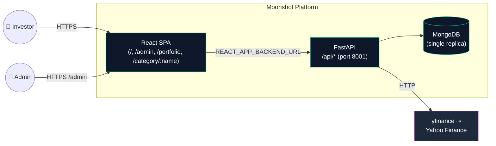
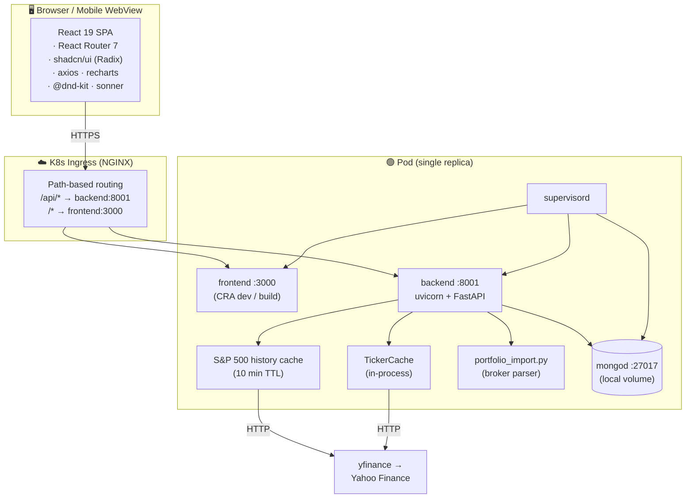
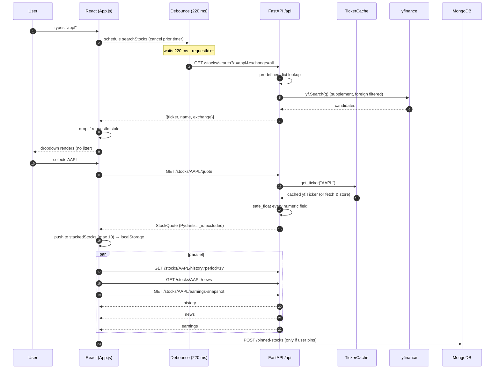
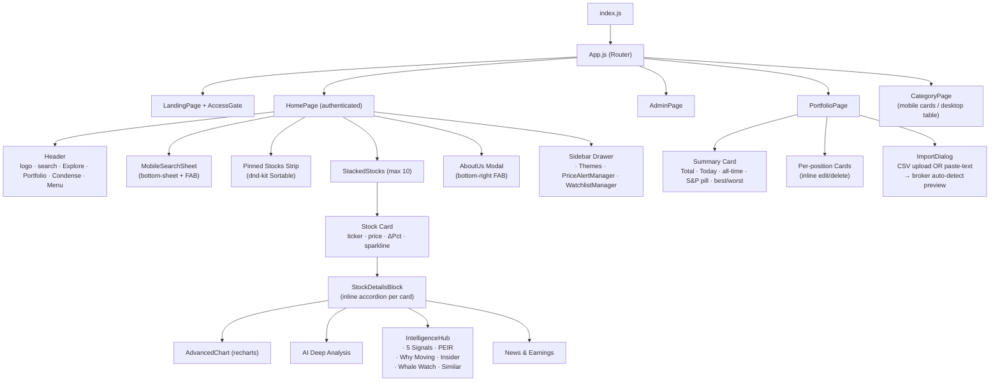
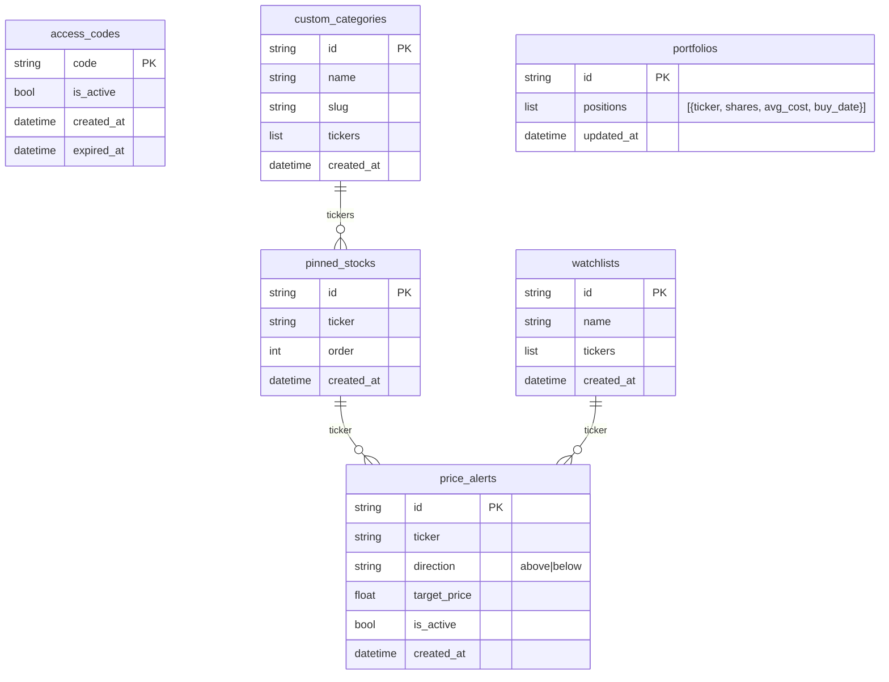
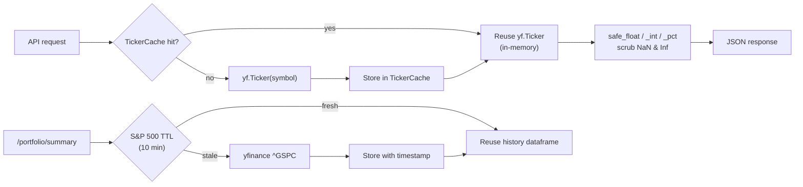
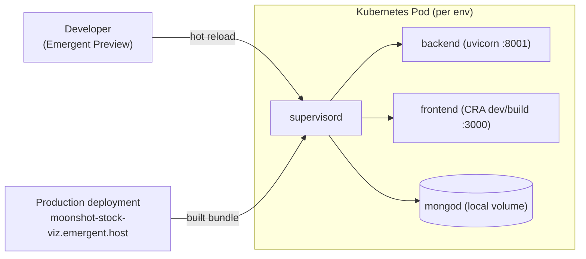

# Moonshot — Technical Architecture

> Engineering deep-dive: components, request flow, data model, API surface, caching, deployment. Companion: [`PRD.md`](./PRD.md) (product) · [`SYSTEM_DESIGN.md`](./SYSTEM_DESIGN.md) (scale, ops, trade-offs).
>
> All diagrams are Mermaid — they render natively on GitHub, VS Code (with the Mermaid plugin), Obsidian, and most Markdown viewers.

---

## 1. System context (C4 — Level 1)

**Trust boundaries.**
- The browser is untrusted — all auth (access codes) is validated server-side on every request.
- yfinance is treated as a flaky third party — every numeric is scrubbed (`safe_float`) before serialization.

---

## 2. Container view (C4 — Level 2)

**Why a single pod with co-located mongod?**
- The product is invite-only with low-hundreds of users in v1 — vertical simplicity beats horizontal scale.
- Stateless backend means we can split mongod out (managed Mongo) any time without app changes — see [`SYSTEM_DESIGN.md` §6](./SYSTEM_DESIGN.md#6-scaling-strategy).

---

## 3. Request flow — search & select a stock

**Two patterns worth calling out:**
- **220 ms debounce + `requestId` ref** — stops dropdown jitter and prevents stale responses overwriting newer ones.
- **Parallel fan-out for detail loads** — quote, history, news, and earnings ship simultaneously over HTTP/1.1 keep-alive; the SPA renders progressively.

---

## 4. Frontend component tree

**State ownership.** Most app-shell state lives in `App.js` (single component, planned for extraction):
- `stackedStocks` — `localStorage`-persisted
- `pinnedStocks`, `searchQuery`, `searchResults`
- `searchTimeoutRef`, `searchRequestIdRef` — power debounce-safe search
- `viewMode` (`spacious` ↔ `condense`), `selectedMarket`, `selectedBackground`

---

## 5. Backend module map

```mermaid
graph LR
    subgraph SRV["server.py (~4 000 LoC)"]
        Auth["Auth & admin<br/>/access/verify · /admin/*"]
        Search["/stocks/search"]
        Quote["/stocks/:t/quote<br/>· /history · /earnings-snapshot<br/>· /news · /health-report<br/>· /candlestick · /indicators"]
        Pinned["/pinned-stocks (CRUD + reorder)"]
        Categories["/stocks/category/:name<br/>+ custom-categories CRUD"]
        Watchlists["/watchlists CRUD"]
        Alerts["/price-alerts<br/>(CRUD · check · dismiss · reset)"]
        Intel["Intelligence Hub<br/>/five-signals · /earnings-intelligence<br/>/why-moving · /insider-alerts<br/>/whale-watch · /similar-stocks"]
        PortAPI["/portfolio CRUD<br/>· /summary · /import"]
        AI["AI<br/>/ai-analysis · /bull-bear-sentiment"]
    end

    PortImp["portfolio_import.py<br/>(broker auto-detect parser)"]
    Models["models/<br/>(Pydantic schemas)"]
    Tests["tests/<br/>(pytest)"]

    SRV --> PortImp
    SRV --> Models
    Tests --> SRV
```

### Defensive serialization layer

Three helpers wrap every numeric leaving the backend:

| Helper       | Purpose                                                      |
| ------------ | ------------------------------------------------------------ |
| `safe_float` | Returns `None` for `NaN`, `±Inf`, `pandas.NA`; else `float`.  |
| `safe_int`   | As above for ints.                                            |
| `safe_pct`   | Validates percent-shaped values (clamps absurd magnitudes).   |

**Why it's mandatory.** yfinance routinely leaks `NaN` from pandas — and FastAPI's JSON encoder raises `ValueError: Out of range float values are not JSON compliant` if even one slips through. Wrapping every numeric is the cheapest insurance.

> **Rule of thumb for contributors:** if you add a new `yfinance` field to a response, you _must_ call `safe_float` / `safe_int` / `safe_pct` on it. There is a pytest that scans 20 tickers across every endpoint to catch regressions.

---

## 6. Data model (MongoDB ERD)

**Notes.**
- No relational FKs — joins happen application-side by ticker string.
- All `id` fields are app-generated UUIDs (we never expose Mongo's `_id`).
- `created_at` / `updated_at` are ISO strings stored as `datetime` and serialized via Pydantic.

---

## 7. API surface (grouped)

| Group               | Endpoints                                                                                                                                                  |
| ------------------- | ---------------------------------------------------------------------------------------------------------------------------------------------------------- |
| **Auth / Admin**    | `POST /api/access/verify` · `POST /api/admin/login` · `GET/POST/PUT/DELETE /api/admin/access-codes`                                                         |
| **Search / Quote**  | `GET /api/stocks/search` · `/stocks/:t/quote` · `/history` · `/news` · `/earnings-link` · `/earnings-snapshot` · `/health-report` · `/candlestick` · `/indicators` |
| **Pinned**          | `GET/POST/DELETE /api/pinned-stocks` · `PUT /api/pinned-stocks/reorder`                                                                                     |
| **Categories**      | `GET /api/stocks/category/:name` · `GET/POST/DELETE /api/custom-categories`                                                                                 |
| **Watchlists**      | Full CRUD + `/api/watchlists/:id/stocks/:ticker` add/remove                                                                                                 |
| **Price Alerts**    | `GET/POST/DELETE /api/price-alerts` · `/check` · `/dismiss` · `/reset`                                                                                      |
| **AI / Intel**      | `/api/stocks/:t/ai-analysis` · `/bull-bear-sentiment` · `/five-signals` · `/earnings-intelligence` · `/smart-earnings` · `/why-moving` · `/insider-alerts` · `/whale-watch` · `/similar-stocks` |
| **Portfolio**       | `GET /api/portfolio` · `/portfolio/summary` · `POST/PUT/DELETE /api/portfolio` · `POST /api/portfolio/import`                                              |
| **Health**          | `GET /health` · `GET /api/health`                                                                                                                          |

OpenAPI / Swagger is auto-generated at `/docs` (FastAPI default).

---

## 8. Caching strategy

| Cache              | Scope           | TTL                       | Why                                              |
| ------------------ | --------------- | ------------------------- | ------------------------------------------------ |
| `TickerCache`      | per-process     | process lifetime          | Avoid re-instantiating `yf.Ticker` for hot symbols |
| S&P 500 history    | per-process     | 10 min                    | 60 s portfolio polling would rate-limit Yahoo     |
| `yf.Search` lookups | **none today**  | _planned (~60 s)_         | Rate-limit defence for company-name search        |

No Redis / external cache — kept in-process for simplicity. See [`SYSTEM_DESIGN.md` §6](./SYSTEM_DESIGN.md#6-scaling-strategy) for when this changes.

---

## 9. Deployment topology

- **Preview** = developer environment with hot reload (FastAPI `--reload` + CRA dev server).
- **Production** = same image, CRA `build`, served statically; preview and production differ only by hostname and the `REACT_APP_BACKEND_URL` env var.
- Secrets (`MONGO_URL`, `DB_NAME`, `REACT_APP_BACKEND_URL`) come from `.env` files mounted into the pod.

---

## 10. Frontend conventions

| Topic              | Convention                                                                                                  |
| ------------------ | ----------------------------------------------------------------------------------------------------------- |
| Files              | One component per file. PascalCase for components, kebab-case for hooks (`use-toast.js`, `usePullToRefresh.js`). |
| Exports            | Named exports for components (`export const ComponentName`), default exports for pages.                     |
| Test IDs           | **Every** interactive element must have `data-testid="kebab-case-purpose"` (e.g. `stock-search-input`). Used by Playwright + e2e tests. |
| Styling            | Tailwind utility-first; shared variables in CSS custom properties. Animations gated on `prefers-reduced-motion`. |
| Icons              | `lucide-react` (no emoji icons in production UI).                                                           |
| Toasts             | `sonner` (`/components/ui/sonner.tsx`).                                                                     |
| Routing            | React Router 7. Routes registered in `App.js`.                                                              |
| Data fetching      | `axios` — no React Query yet (state is simple enough to live in `App.js`).                                  |

---

## 11. Backend conventions

| Topic              | Convention                                                                                                                                  |
| ------------------ | ------------------------------------------------------------------------------------------------------------------------------------------- |
| Route prefix       | **All** API routes mount under `/api`. Required by the ingress.                                                                              |
| Models             | Pydantic `BaseModel` (`/backend/models`). Use as `response_model=` wherever possible — guarantees `_id` exclusion and NaN/Inf safety.        |
| Async DB           | Motor (`AsyncIOMotorClient`). Never use sync `pymongo` in request handlers.                                                                  |
| Env config         | `os.environ.get('MONGO_URL')` etc. **Never** hard-code; missing env should fail fast.                                                        |
| Time               | `datetime.now(timezone.utc)`. Never `datetime.utcnow()` (deprecation + tz-naïve).                                                            |
| External calls     | All `yfinance` calls go through helpers that wrap `try / except` and degrade to `None`. Never let an upstream failure 5xx the whole endpoint. |
| Errors             | Raise `HTTPException` with structured detail; never `print` for errors. Use `logging.getLogger`.                                             |
| Tests              | `pytest` under `/backend/tests/`. Each new route ⇒ at least one happy-path + one NaN/edge-case test.                                         |

---

## 12. Security model

- **Access codes** are random, single-use-per-redemption, stored as plaintext (no PII tied to them). Validation is constant-time.
- **Admin password** is bcrypt-hashed in the environment. Login mints a JWT (24 h TTL) signed with `JWT_SECRET`.
- **Rate limiting** is delegated to the ingress (FastAPI middleware is a planned addition).
- **CORS** is permissive in preview, locked to the production hostname in prod (`CORS_ALLOW_ORIGINS` env).
- **No PII** is collected — we don't tie sessions to email/name in v1.

---

## 13. Observability (current state)

| Signal       | Where                                                  |
| ------------ | ------------------------------------------------------ |
| App logs     | `/var/log/supervisor/backend.*.log`, `frontend.*.log`  |
| Health probe | `GET /health` (no DB call) · `GET /api/health` (DB ping) |
| Metrics      | Not yet wired — planned: Prometheus scrape + Grafana   |
| Traces       | Not yet wired — planned: OpenTelemetry → Tempo         |
| Errors       | Surfaced via `sonner` toast on the client; logged server-side. Sentry is a tracked enhancement. |

---

## 14. Known tech debt (tracked in PRD § 11)

- `server.py` ~4 000 LoC → split into `routes/` per resource.
- `App.js` ~1 950 LoC → extract `Header`, `Sidebar`, `StockList`.
- Predefined ticker dict baked into `search_stocks()` → move to module-level constant.
- Add TTL cache around `yf.Search`.
- Replace in-process caches with Redis once we run > 1 backend replica.
- Remove orphaned `CategoriesPage.js`.

---

_Last updated: Feb 2026 — regenerate whenever a route group or major component is added._
