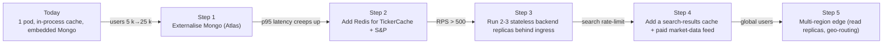

# Moonshot — System Design

> Staff/Principal engineering deep-dive: load model, capacity, scaling roadmap, trade-offs, failure modes, observability, security, and the "why we chose this" rationale. Companions: [`PRD.md`](./PRD.md) · [`ARCHITECTURE.md`](./ARCHITECTURE.md).

---

## 1. Design philosophy

> **"As simple as possible, given the constraints. Optimise for the smallest production surface that still validates the product hypothesis."**

Three principles drive every decision:

1. **Boring tech wins.** FastAPI + Mongo + React on a single pod. No micro-services until we can't avoid them.
2. **Treat upstream data as hostile.** yfinance leaks NaN, Inf, missing fields, and rate limits aggressively. Every external value is scrubbed through a defensive layer.
3. **Make the hot path obvious.** A new contributor should be able to trace a search-to-render flow in 30 minutes.

---

## 2. Functional / non-functional requirements (recap)

See [`PRD.md` § 8](./PRD.md#8-non-functional-requirements). The numbers that drove this design:

| Constraint               | Target                  |
| ------------------------ | ----------------------- |
| MAU (invite-only)        | 1 – 5 k                  |
| Concurrent users (peak)  | ≤ 200                   |
| Endpoints / user / minute | ~ 30                    |
| Cold yfinance latency    | 600 – 1 200 ms          |
| Cached endpoint p95      | ≤ 300 ms                |
| Uptime SLO               | 99.5 % monthly          |
| Mobile share             | ≥ 50 %                  |

These bounds make a **single-pod, single-replica** topology not just acceptable but optimal — anything more is operational drag for no user benefit.

---

## 3. Load model & capacity envelope

### Workload mix (typical session, ~5 min)

| Action                        | Calls per session | Cacheable? |
| ----------------------------- | ----------------- | ---------- |
| Search (debounced 220 ms)     | 4 – 10            | ❌ (query-dependent) |
| Quote / history / news fan-out | 3 per stock × 3 stocks ≈ 9 | ✅ TickerCache  |
| Pin / reorder                 | 1 – 2             | ❌          |
| Portfolio polling (60 s)      | 60 ÷ 60 = 1 / min | ✅ for S&P 500 |
| AI Deep Analysis              | 0 – 1             | ✅ TickerCache  |
| Intelligence Hub              | 0 – 6             | ✅ TickerCache  |

**Per-user RPM:** ~ 25 – 40 → **peak RPS at 200 concurrent ≈ 130**.
A single uvicorn worker on a 2-vCPU box comfortably handles **~ 500 RPS** for cached endpoints (p95 < 200 ms). We have **~ 4× headroom**.

### Memory envelope
- `TickerCache` worst case (S&P 500 + Nifty 50 ≈ 550 tickers) ≈ **150 MB** RSS.
- S&P 500 history cache ≈ 4 MB.
- Mongo working set ≈ 50 MB (codes, pins, custom categories, portfolios).

Total pod memory headroom on a 1 GiB pod: comfortable.

---

## 4. Key design decisions (with trade-offs)

| # | Decision                                                      | Alternatives considered                                | Why we chose it                                                                                       | Costs / risks                                                                                                 |
| - | ------------------------------------------------------------- | ------------------------------------------------------ | ----------------------------------------------------------------------------------------------------- | ------------------------------------------------------------------------------------------------------------- |
| 1 | **Single pod, single replica** with co-located Mongo          | Managed Mongo + multiple stateless replicas             | Lowest ops cost; product is invite-only & small                                                       | Single point of failure; vertical-only scaling. Mitigated by a backup cron + clear scale-out path (§ 6).      |
| 2 | **In-process `TickerCache` & S&P 500 TTL** (no Redis)         | Redis or memcached                                      | Within a single replica, in-process is free, fast, and zero ops                                       | Cache is per-replica → not shareable when we horizontally scale. Switch is a 1-day task (§ 6).                 |
| 3 | **Stateless backend; `stackedStocks` in `localStorage`**      | Server-side sessions; per-user DB                       | Removes per-user persistence work; lets us ship faster                                                | User loses stack on browser change. Solvable later with optional account-bound storage.                       |
| 4 | **Access-code auth, not OAuth / passwords**                   | Google OAuth · email+password                            | Aligns with invite-only distribution; no PII to store                                                  | Doesn't scale to public launch; admin must mint codes                                                          |
| 5 | **220 ms debounce + `requestId` ref for search**              | Request cancellation via `AbortController`              | Simpler code; cancellation only saves Yahoo a request, not the user time                              | Stale requests still complete on backend (wasted Yahoo quota in worst case)                                   |
| 6 | **`safe_float / safe_int / safe_pct` on every yfinance value** | Pydantic `validator` + `condecimal`                     | One-liner, dead-simple, explicit at every call site                                                   | Boilerplate; easy to forget on a new endpoint (a pytest scans 20 tickers to catch this)                       |
| 7 | **Mobile-first, single SPA** (no native apps)                 | React Native + shared web                               | One codebase; mobile-web parity is good enough                                                        | Native gestures (haptics, deep notifications) require a future React Native port                              |
| 8 | **Inline per-stock accordion** (vs sticky detail pane)        | Modal · drawer · separate route                          | Matches mental model of "compare these 3 stocks side by side"; preserves scroll context              | Heavier DOM when 10 stocks are stacked — mitigated by lazy-loading detail blocks                              |
| 9 | **CSV + paste-text broker-agnostic parser**                   | Plaid / SnapTrade / per-broker integrations             | Zero integration cost; works for every broker that exports CSV                                        | Manual parser maintenance when brokers change formats                                                          |
| 10 | **Mobile category page → cards, desktop → table**            | Horizontal scroll, sticky columns                       | Card layout is faster to scan on phones; preserves info hierarchy                                     | Two code paths; mitigated by Tailwind `md:` conditionals in one file                                          |

---

## 5. Failure modes & mitigations

| Failure                                          | User impact                            | Mitigation                                                                                                            |
| ------------------------------------------------ | -------------------------------------- | --------------------------------------------------------------------------------------------------------------------- |
| yfinance returns `NaN` / `Inf`                   | 500s on legacy code; now suppressed    | Mandatory `safe_*` helpers + 20-ticker pytest regression                                                              |
| yfinance times out / 429-rate-limits             | Slow page; missing data                | `TickerCache` + S&P 500 TTL cache; per-endpoint `try / except` degrading to partial JSON; user sees a toast            |
| MongoDB unavailable                              | Pins / portfolios / alerts fail        | Stack & search still work (read from yfinance live); UI shows error toast; planned: retry middleware                  |
| Browser drops connection mid-fan-out             | Partial UI                             | Components render whatever they have; no UI is blocked on _all_ requests succeeding                                   |
| Access-code brute force                          | Account-takeover (sort of)             | Codes are 8+ alphanumeric (62⁸ space); planned: ingress-level rate limit on `/access/verify`                          |
| Yahoo changes search response shape              | Empty search results                   | Predefined ticker dict still serves ~500 hot symbols; alarm via search-success ratio metric (planned)                  |
| Pod restart                                      | TickerCache + S&P TTL warm-up          | First few requests cold (1 – 2 s); cache rebuilds within 1 minute of traffic                                          |
| Single-pod outage                                | Hard down                              | Acceptable at v1 SLO; uptime monitor pings every 60 s; runbook to redeploy in < 5 min                                  |

---

## 6. Scaling strategy

We've designed for **vertical first, horizontal when forced**. The scale-out path is deliberately short:

| Step | Trigger                           | Effort      | Rationale                                                          |
| ---- | --------------------------------- | ----------- | ------------------------------------------------------------------ |
| 1    | Backup pain / DR SLO              | 0.5 day     | Mongo Atlas handles snapshots, replication, point-in-time recovery |
| 2    | p95 > 400 ms on cached endpoints  | 1 day       | Redis becomes the shared TickerCache + S&P history TTL store       |
| 3    | RPS > 500 or memory headroom < 30 % | 1 day      | Backend is already stateless; just bump replicaCount               |
| 4    | yfinance rate limits become daily  | 2 weeks     | Cache search results; evaluate paid market data (Polygon, Alpaca)  |
| 5    | EU / APAC user growth              | Multi-week  | Read replicas, edge ingress, geo-routed CDN                        |

We are **at Step 0** today. The next likely move is **Step 1** when production goes from preview-tested to truly multi-user.

---

## 7. Data flow & consistency

- **Read path (quotes, history, news)** is _eventually consistent_ — yfinance is the source of truth, our cache lags by up to TickerCache lifetime (process restart) or 10 minutes (S&P 500).
- **Write path (pins, alerts, portfolio)** is _strongly consistent_ — MongoDB is the source of truth; we use Motor with default write-concern.
- **Cross-collection consistency** is not required (no transactions). All app-side joins are by ticker string.

> **Anti-corruption** is performed at the boundary: every numeric crossing from yfinance → API response is scrubbed; every BSON `ObjectId` is excluded; every datetime is converted to UTC ISO.

---

## 8. Observability & SLOs

| Tier            | Today                                                            | Planned                                                              |
| --------------- | ---------------------------------------------------------------- | -------------------------------------------------------------------- |
| **Logs**        | `supervisord` files, `logging.getLogger` per module               | Ship to Loki / Datadog                                                |
| **Metrics**     | _none_                                                            | Prometheus scrape: RPS, p95, cache hit ratio, yfinance error rate     |
| **Traces**      | _none_                                                            | OpenTelemetry → Tempo for fan-out request correlation                 |
| **Errors**      | Client toast + server log                                         | Sentry SDK (frontend + backend) with release tagging                  |
| **Uptime**      | Ingress healthcheck                                               | External pinger (UptimeRobot / Better Stack) on `/api/health`         |

**SLIs.**
- Availability: % `/api/health` successes per 5 min.
- Latency: p95 on `/api/stocks/:t/quote` (cached + cold).
- Quality: % search queries returning ≥ 1 result.

**SLOs.**
- 99.5 % availability, monthly.
- p95 ≤ 300 ms (cached), ≤ 1 500 ms (cold).
- Search-success ratio ≥ 95 %.

---

## 9. Security posture

| Concern                  | Control                                                                                                          |
| ------------------------ | ---------------------------------------------------------------------------------------------------------------- |
| Authentication           | Access codes (server-side validation) · admin password (bcrypt) → JWT (24 h)                                     |
| Authorisation            | Admin routes gated by JWT. Public routes have no per-user identity in v1.                                        |
| Secrets                  | `.env` files; never committed; production env vars injected via the deployment platform.                          |
| PII                      | None collected. Portfolios contain ticker symbols + quantities, no personally identifying info.                  |
| Transport                | HTTPS via the Kubernetes ingress; HSTS enforced.                                                                  |
| Input validation         | Pydantic models; query params constrained.                                                                       |
| Output encoding          | FastAPI auto-encodes JSON. No HTML templating on the server → no XSS surface.                                    |
| CORS                     | Locked to production origin in prod; permissive in preview for hot reload.                                       |
| Rate limiting            | Ingress-level (TODO: per-route inside FastAPI middleware).                                                       |
| Dependency CVEs          | `pip-audit` + `yarn audit` in CI (planned).                                                                      |
| Data deletion            | Admin can revoke codes; portfolio rows have a hard `DELETE` endpoint. No soft-delete / GDPR pipeline yet.        |

---

## 10. Build, ship, run

- **Branching.** `main` is always deployable. Feature branches via PR.
- **CI (planned).** Lint (`ruff` + `eslint`) → backend pytest → frontend `yarn build` → upload artefact.
- **CD.** Push-button redeploy on the Emergent platform — production and preview pods share an image; differing env vars drive behaviour.
- **Roll-back.** Use the platform's checkpoint system (every code commit is a restorable point). No git revert needed.
- **Backups.** Mongo dump cronned to platform-managed object storage (planned: 15-min snapshots once Atlas migration lands).

---

## 11. Risk register (top 5)

| # | Risk                                                       | Impact | Likelihood | Mitigation                                              |
| - | ---------------------------------------------------------- | ------ | ---------- | ------------------------------------------------------- |
| 1 | yfinance becomes rate-limited or shuts down                 | High   | Medium     | Evaluate paid feeds (Polygon, Alpaca) at Step 4; cache aggressively |
| 2 | Single pod outage during a market event                     | High   | Low        | Move Mongo to Atlas (§ 6 Step 1); add a second replica   |
| 3 | Portfolio parser breaks on a new broker CSV variant         | Medium | Medium     | Snapshot-based regression tests; ask users for examples  |
| 4 | NaN/Inf regression on a newly added endpoint                | Medium | Medium     | Mandatory `safe_*` helpers + 20-ticker regression pytest |
| 5 | Code-redemption brute force                                 | Low    | Low        | 62⁸ key space + planned ingress rate limit               |

---

## 12. Open questions / forward-looking

- **Paid market-data feed.** When does yfinance flakiness force us to pay for Polygon / Alpaca? Track via search-success-ratio and yfinance error rate.
- **Account-bound storage.** Should logged-in users be able to sync `stackedStocks` across devices? Requires a real user account model (out of scope for v1).
- **Community signals.** Aggregating "most-stacked stocks" across all users could be a viral hook — privacy and aggregation thresholds need design.
- **Mobile native.** A React Native port unlocks haptics, deep-linked notifications (price alerts), and home-screen widgets. Decision gate: ≥ 60 % mobile share + paid users.

---

_For the per-module technical detail, see [`ARCHITECTURE.md`](./ARCHITECTURE.md). For roadmap and prioritisation, see [`PRD.md`](./PRD.md)._
