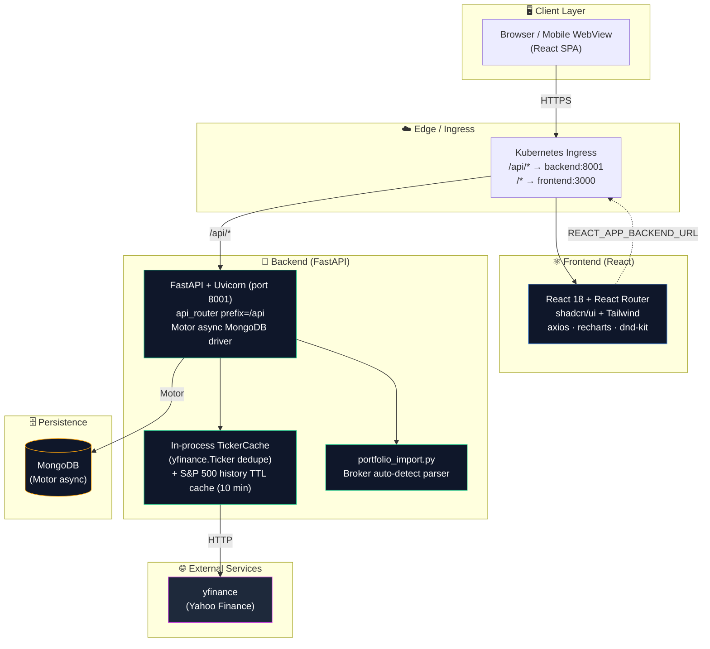
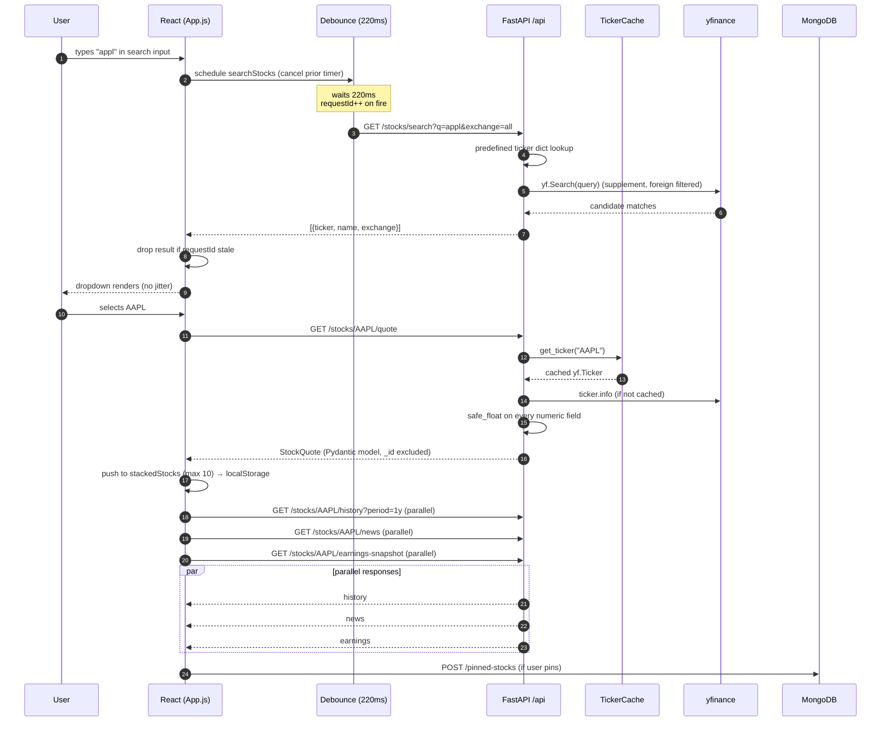
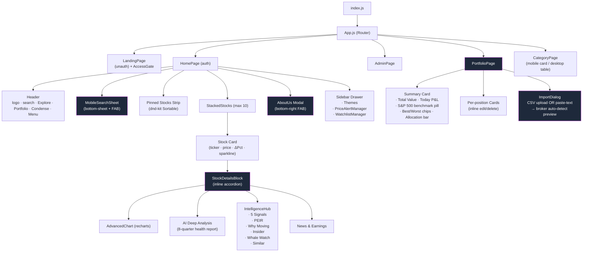
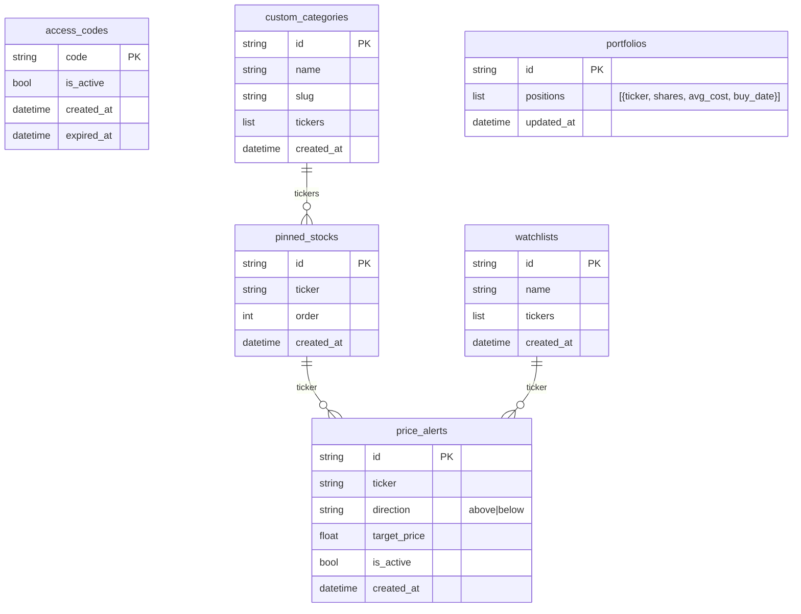
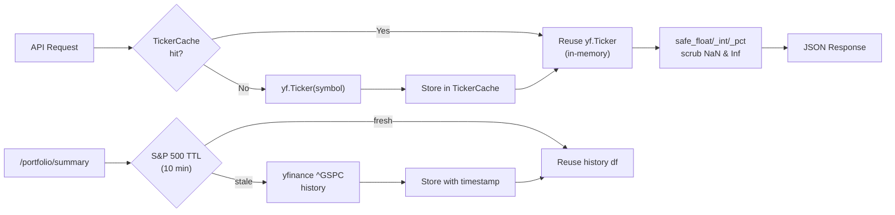
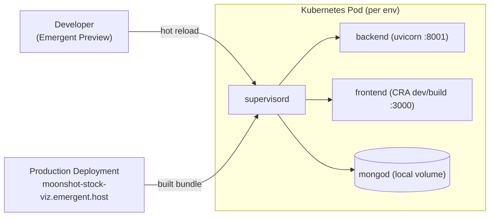

# Moonshot — System Design & Architecture

> Companion to `/app/memory/PRD.md`. All diagrams are Mermaid — they render natively on GitHub, VS Code (with Mermaid plugin), Obsidian, and most Markdown viewers.

---

## 1. High-Level System Architecture

**Key facts:**
- Single-page React app served at `/`, FastAPI mounted at `/api/*` behind a shared K8s ingress.
- Backend never holds long sessions — every request is stateless aside from the in-process `TickerCache`.
- All external data (prices, fundamentals, news) flows through `yfinance` and is normalised through `safe_float / safe_int / safe_pct` helpers before serialization.

---

## 2. Request Flow — Stock Search & Selection

**Why this matters:**
- The debounce + requestId pattern (introduced Feb 2026) is what stops dropdown jitter on every keystroke.
- All Yahoo Finance calls go through `TickerCache` so the same ticker isn't fetched multiple times within a request burst.
- `safe_float / safe_int` wrappers convert NaN / Infinity / pandas-NA into `None` before Pydantic serialization — otherwise FastAPI's JSON encoder crashes.

---

## 3. Frontend Component Tree

**Key state managed in `App.js`:**
- `stackedStocks` (persisted to `localStorage`)
- `pinnedStocks`, `searchQuery`, `searchResults`
- `searchTimeoutRef`, `searchRequestIdRef` — power the debounce-safe search
- `viewMode` (`spacious` ↔ `dense/condense`), `selectedMarket`, `selectedBackground`

---

## 4. Backend Module Map

```mermaid
graph LR
    subgraph SRV["server.py (~4,000 lines)"]
        Auth["Access codes<br/>/access/verify · /admin/*"]
        Search["/stocks/search<br/>(predefined dict + yf.Search)"]
        Quote["/stocks/:t/quote · /history<br/>· /earnings-snapshot · /news<br/>· /health-report"]
        Pinned["/pinned-stocks<br/>(CRUD + reorder)"]
        Categories["/stocks/category/:name<br/>+ custom-categories CRUD"]
        Watchlists["/watchlists CRUD"]
        Alerts["/price-alerts<br/>(CRUD · check · dismiss · reset)"]
        Intel["Intelligence Hub<br/>/five-signals · /earnings-intelligence<br/>/why-moving · /insider-alerts<br/>/whale-watch · /similar-stocks"]
        PortAPI["/portfolio CRUD<br/>/portfolio/summary<br/>/portfolio/import"]
        AI["AI Deep Analysis<br/>/ai-analysis · /bull-bear-sentiment"]
        Indicators["/candlestick · /indicators"]
    end

    PortImp["portfolio_import.py<br/>(broker auto-detect parser)"]
    Models["models/<br/>(Pydantic schemas)"]
    Tests["tests/<br/>(pytest fixtures)"]

    SRV --> PortImp
    SRV --> Models
    Tests --> SRV
```

**Defensive serialization layer (shared):**
- `safe_float(x)` → returns `None` if `NaN / Inf / pandas-NA`, else `float(x)`
- `safe_int(x)` → analog for ints
- `safe_pct(x)` → returns `None` for invalid percent values
- `_id` is **always excluded** from MongoDB responses via projection or Pydantic models.

---

## 5. Data Model (MongoDB Collections)

No relational FKs — joins happen application-side (by ticker string).

---

## 6. API Surface Map (Grouped)

| Group               | Endpoints                                                                                                                                                                                                                                            |
| ------------------- | ---------------------------------------------------------------------------------------------------------------------------------------------------------------------------------------------------------------------------------------------------- |
| **Auth / Admin**    | `POST /access/verify` · `POST /admin/login` · `GET/POST/PUT/DELETE /admin/access-codes`                                                                                                                                                              |
| **Search & Quote**  | `GET /stocks/search` · `GET /stocks/:t/quote` · `/history` · `/news` · `/earnings-link` · `/earnings-snapshot` · `/health-report` · `/candlestick` · `/indicators`                                                                                   |
| **Pinned**          | `GET/POST/DELETE /pinned-stocks` · `PUT /pinned-stocks/reorder`                                                                                                                                                                                      |
| **Categories**      | `GET /stocks/category/:name` · `GET/POST/DELETE /custom-categories`                                                                                                                                                                                  |
| **Watchlists**      | full CRUD + `/stocks/:ticker` add/remove                                                                                                                                                                                                             |
| **Price Alerts**    | `GET/POST/DELETE /price-alerts` · `GET /price-alerts/check` · `POST /price-alerts/:id/dismiss` · `/reset`                                                                                                                                             |
| **AI / Intel**      | `/ai-analysis` · `/bull-bear-sentiment` · `/five-signals` · `/earnings-intelligence` · `/smart-earnings` · `/why-moving` · `/insider-alerts` · `/whale-watch` · `/similar-stocks`                                                                     |
| **Portfolio**       | `GET /portfolio` · `GET /portfolio/summary` · `POST/PUT/DELETE /portfolio` · `POST /portfolio/import`                                                                                                                                                |
| **Health**          | `GET /health` · `GET /api/health`                                                                                                                                                                                                                    |

---

## 7. Caching Strategy

- **TickerCache** prevents redundant `yf.Ticker` instantiations within a single backend process. Lifetime = process lifetime (cleared on backend restart).
- **S&P 500 history cache** is a separate dict keyed by `(period, start_date)` with a 10-minute TTL — added to handle the 60-second portfolio polling without rate-limiting Yahoo.
- No Redis / external cache — kept in-process for simplicity.

---

## 8. Deployment Topology

- Both **preview** and **production** are the same image / topology, just different ingress hostnames.
- Hot reload enabled in preview only (FastAPI reload + CRA dev server).
- All secrets (`MONGO_URL`, `DB_NAME`, `REACT_APP_BACKEND_URL`) come from `.env` files mounted into the pod.

---

## 9. Key Architectural Decisions

| Decision                                        | Rationale                                                                                                  |
| ----------------------------------------------- | ---------------------------------------------------------------------------------------------------------- |
| **Stateless backend + localStorage stacks**     | Avoids per-user auth complexity. Users keep their stack across reloads without a DB write per interaction. |
| **Single-process TickerCache** (no Redis)       | Fast enough for current scale; avoids ops burden. Trade-off: cache is per-replica.                         |
| **Predefined ticker dict + yfinance Search**    | Predefined is instant for the top ~500 tickers; yfinance.Search supplements long-tail names like "Salesforce". |
| **Per-card inline accordion** (Option A)        | Replaces a single-selected-stock detail block with per-ticker expandable panels; supports parallel refresh. |
| **Mobile card layout for CategoryPage**         | 12-col grid table overlaps badly on 390px; cards eliminate horizontal cramping while keeping desktop table.|
| **220ms search debounce + requestId guard**     | Prevents per-keystroke dropdown jitter and stale-response overwrites.                                      |
| **safe_float / safe_int everywhere**            | yfinance leaks NaN/Inf which break FastAPI's `JSONEncoder`. One-line guard at every numeric assignment.    |
| **Broker-agnostic CSV parser**                  | Lets users paste statements from Robinhood/Fidelity/Schwab/Vanguard/E*TRADE/Webull without manual mapping. |
| **Access-code auth (not OAuth)**                | Invite-only product; keeps friction low and removes OAuth-provider dependency.                             |

---

## 10. Known Tech Debt / Refactor Backlog

- `App.js` is still ~1,950 lines. Next extraction candidates: `Header`, `Sidebar`, `StockList`.
- `server.py` is ~4,000 lines. Should split into `routes/` per resource (search, quotes, alerts, intelligence, portfolio).
- Predefined ticker dictionaries should move out of `search_stocks()` into a module-level constant.
- Add a TTL cache around `yf.Search` results to reduce rate-limit risk.
- Replace in-process caches with Redis once we add a second backend replica.
- Remove orphaned `CategoriesPage.js` (still routed, functionally duplicated by the Explore popover).

---

_Last updated: Feb 2026 — to be regenerated whenever a route group or major component is added._
